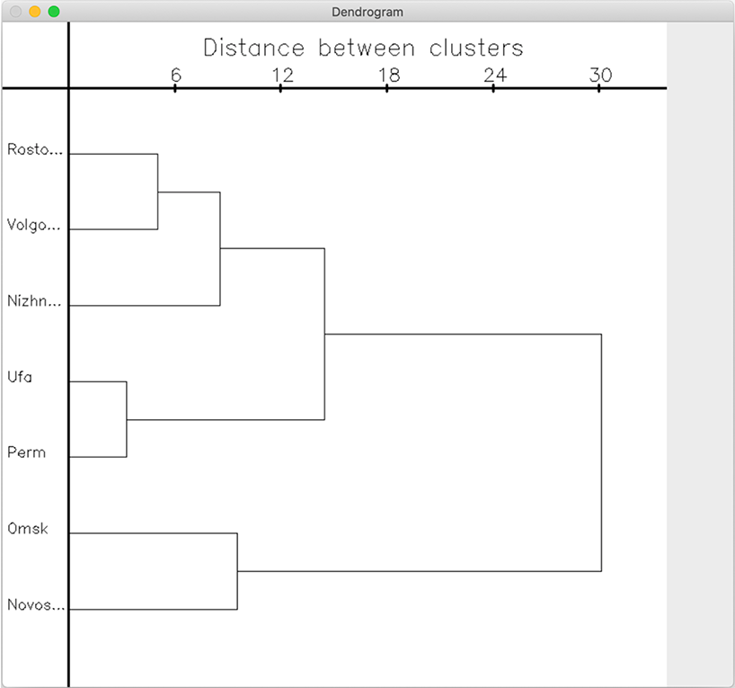

# Dendrogram
Библиотека для C++, позволяющая создавать изображения дендрограмм (древовидного иерархического представления) на основе входных данных.

## Установка
Для установки и  использования требуется CMake 3.17.2 и OpenCV 4.5.1.

1. Распаковать репозиторий в удобном месте
2. Сконфигурировать в CMake
3. Для установки библиотеки собрать __install_dendrogram_library_test__
4. Для тестирования библиотеки собрать __dendrogram_library_test__


## Использование

```C++
// Вектор координат крупнейших городов
std::vector<double> coord { 
54.7349439, 55.9578468, 
48.7070042, 44.5170339, 
56.3240627, 44.0053912, 
55.0281910, 82.9211489, 
54.9848566, 73.3674517, 
58.0102583, 56.2342034,
47.2224566, 39.7188030
}

// Вектор названий городов
std::vector<std::string> labels{
        "Ufa",
        "Volgograd",
        "Nizhnij",
        "Novosibirsk",
        "Omsk",
        "Perm",
        "Rostov" };

// Преобразуем в вектор cv::Point2f
std::vector<cv::Point2f> points;
for (size_t i = 0; i < coord.size(); i+=2) {
points.push_back(cv::Point2f(coord[i], coord[i + 1])); }

// Выведем дендрограмму на экран
cv::Mat img = get_dendrogram(points, labels, 768); cv::imshow("Dendrogram", img);
cv::waitKey(0);
```



